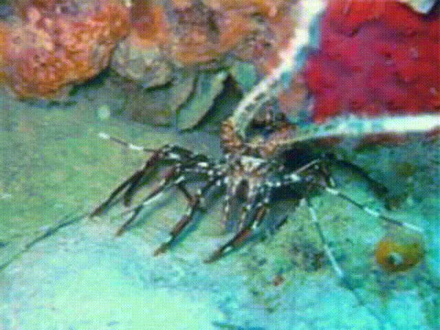
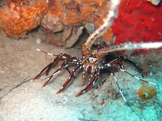

# WWE-UIE: A Wavelet & White Balance Efficient Network for Underwater Image Enhancement

[](https://arxiv.org/abs/2511.16321)
[](https://www.python.org/downloads/release/python-3100/)
[](https://pytorch.org/)
[](LICENSE)

> **Note:** This repository is an **enhancement** of the original base paper. The architecture and training procedures have been customized and improved to achieve higher PSNR and SSIM values compared to the baseline.

## Overview
**Authors:** Ching-Heng Cheng, Jen-Wei Lee, Chia-Ming Lee, Chih-Chung Hsu  
**Affiliations:** Advanced Computer Vision LAB, National Cheng Kung University and National Yang Ming Chiao Tung University  

**Abstract:**  
This project provides a PyTorch implementation and significant enhancements for "WWE-UIE: A Wavelet & White Balance Efficient Network for Underwater Image Enhancement." The primary focus of this repository is to refine the baseline model, optimizing for superior quantitative metrics (PSNR and SSIM) and qualitative visual restoration of underwater images.

**Repository Purpose:**  
This repository contains the original base paper implementation alongside our modified and enhanced training, evaluation, and ablation scripts. It provides the datasets layout, trained model checkpoints, and experimental results required to reproduce both the baseline and the enhanced models.

**Tech Stack:**
- Python 3.10
- PyTorch 2.4.0 + CUDA 11.8

---

## Installation

1. **Clone the Repository:**
   ```bash
   git clone https://github.com/DHANUSH-BHEEMSETTY/WWE-UIE-A-Wavelet-White-Balance-Efficient-Network-for-Underwater-Image-Enhancemen.git
   cd WWE-UIE-A-Wavelet-White-Balance-Efficient-Network-for-Underwater-Image-Enhancemen
   ```

2. **Environment Setup:**
   Ensure you have Python 3.10 and PyTorch 2.4.0 (with CUDA 11.8) installed.
   ```bash
   pip install -r Source\ Code/requirements.txt
   ```

3. **Dataset Preparation:**
   Datasets (e.g., UFO-120, UIEB) should be placed in the `UnderWaterDataset/` folder following standard train/val/test splits with `input/` and `GT/` subdirectories.

---

## Usage

### Running the Enhanced Model
We provide customized scripts that incorporate our enhancements for training and testing.
```bash
cd "Modified Code and Output Images"

# Start the enhanced training process
python quick_train_v2.py
```

### Running the Baseline Model
To replicate the original base paper results:
```bash
cd "Source Code"

# Train the baseline model
python train.py --dataset UFO-120 --epoch 100 --train_batch_size 24 --model_name WWE-UIE

# Evaluate the baseline model
python test.py --dataset UFO-120 --ckpt [checkpoint.pth]
```

---

## Repository Structure

```
DIP-RESEARCH-PAPER/
├── Base Paper/                         # Original research papers referenced in this project.
├── Checkpoints and Intermediate Files/ # Model weights (.pth) and intermediate training outputs.
├── Description of Changes Made/        # Documentation of architectural and training enhancements.
├── Modified Code and Output Images/    # Enhanced scripts (e.g., train_v2.py) and new visual outputs.
├── Presentation Material/              # PowerPoint slides and resources for project demonstrations.
├── Results and Output Images/          # Final qualitative and quantitative evaluation results.
├── Source Code/                        # Original/baseline project scripts (model.py, train.py).
├── UnderWaterDataset/                  # Directory for paired and non-reference datasets.
└── demo/                               # GIFs and sample reference images for README visualization.
```

---

## Results

Through architectural modifications and hyperparameter tuning, the enhanced version of the WWE-UIE model achieves **superior PSNR and SSIM** values compared to the baseline reported in the base paper. 

**Full-reference Examples:**
|   |   |
|:---:|:---:|

Detailed output logs and visual comparisons can be found in the `Results and Output Images/` directory.

---

## Citation

If you use the original baseline code or datasets, please cite the base paper:

```bibtex
@misc{cheng2025wweuiewaveletwhite,
      title={WWE-UIE: A Wavelet & White Balance Efficient Network for Underwater Image Enhancement}, 
      author={Ching-Heng Cheng and Jen-Wei Lee and Chia-Ming Lee and Chih-Chung Hsu},
      year={2025},
      eprint={2511.16321},
      archivePrefix={arXiv},
      primaryClass={cs.CV},
      url={https://arxiv.org/abs/2511.16321}, 
}
```

---

## License

This project is licensed under the [MIT License](LICENSE) (or the corresponding license specified in the `LICENSE` file). See the LICENSE file for details.
